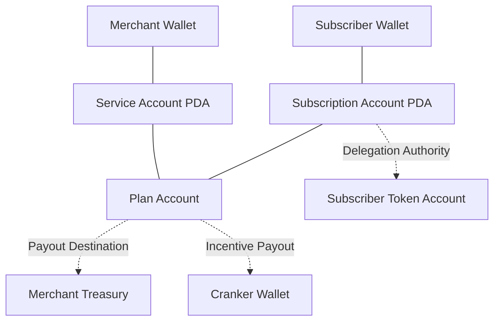
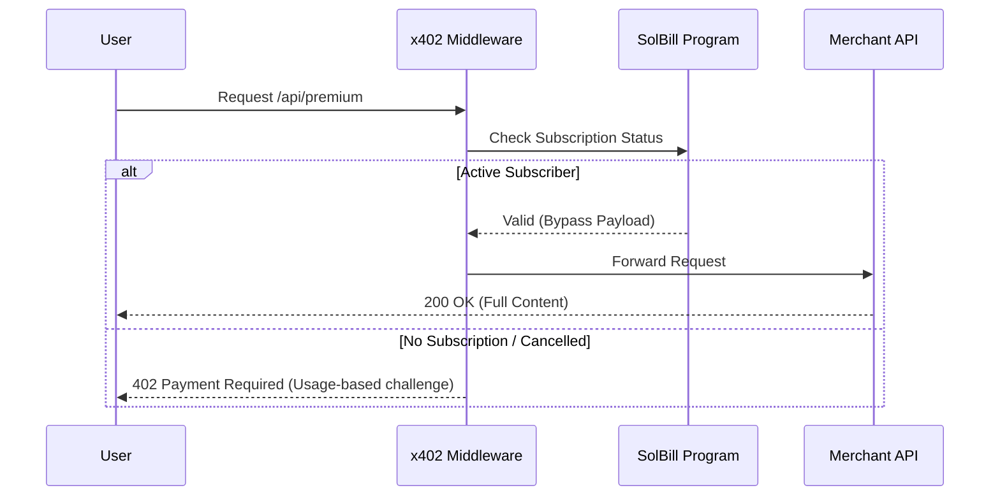

# SolBill: Autonomous Recurring Billing Engine

SolBill is a production-grade, non-custodial recurring billing protocol built on Solana. It reimagines traditional Web2 subscription systems (like Stripe) as a transparent, on-chain autonomous ecosystem. It features an on-chain task queue, price protection, and a unique **Unified Billing Gateway** via x402 integration.

---

## 🎯 The "Rebuilding Web2" Thesis

In Web2, subscriptions operate on a centralized "Pull" model: a company stores your payment details and triggers a private cron job to charge your card.

**SolBill** rebuilds this entire system on Solana:

- **The "Rules"** live on-chain as a deterministic Solana Program.
- **The "Queue"** (which payments are due) is public, auditable on-chain state.
- **The "Worker"** is a lightweight, incentivized script anybody can run.
- **The "Control"** rests entirely with the user via token delegations.

---

## 🔁 The Billing Lifecycle (How it Works)

The features of SolBill are best understood sequentially through the lifecycle of a subscription.

### 1. Merchant Setup: Merchant-First Design

Merchants create a `Service` on-chain, defining their own treasury wallet and the SPL token they accept (e.g., Devnet USDC or Native SOL).

### 2. Plan Creation: Flexible Billing Cycles

The merchant generates subscription `Plans` with customizable rules:

- **Infinite**: Traditional recurring subscriptions (e.g., monthly).
- **Fixed-Term**: Installment plans that auto-terminate (e.g., 12 months).
- **One-Time**: Lifetime proxy purchases.

### 3. User Subscription: Non-Custodial & Secure

A user subscribes to a plan by delegating exactly the monthly amount to the `Subscription` PDA via the SPL Token Program. SolBill never takes custody of user funds; they move directly from Subscriber to Merchant Treasury.

### 4. Price Protection: Enforced Grandfathering

At the moment of subscription, the user's price is **locked on-chain for life**. If the merchant later hikes the price of the plan, existing subscribers remain protected indefinitely.

### 5. Payment Collection: Autonomous Cranking & Permissionless Bounties

When a subscription's `next_billing_timestamp` is reached, it enters the public queue. Any bot or user can execute the `collect_payment` instruction. The program mathematically enforces the collection block time and pays the executor a fixed **Crank Reward** (bounty) instantly.

### 6. Premium Access: Unified Billing Gateway (x402)

SolBill integrates with the **x402** protocol to provide a hybrid premium gateway. Active subscribers transparently bypass usage-based paywalls. If a user cancels (or isn't subscribed), the gateway falls back to requiring micro-payments via the standard 402 HTTP challenge.

---

## 🏗 Architecture Analysis: Web2 vs. Solana

### 1. Simple Comparison

| Feature        | Web2 (Stripe + SQS)                  | SolBill (Solana)                          |
| :------------- | :----------------------------------- | :---------------------------------------- |
| **State**      | Centralized SQL Database.            | On-Chain PDAs (Public & Auditable).       |
| **Trust**      | Users trust Stripe/Bank.             | Users trust **Open-Source Code**.         |
| **Control**    | Dark patterns in cancellation.       | **Instant Revocation** via Token Program. |
| **Automation** | Private Cron Jobs (Stripe Internal). | **Incentivized Cranks** (Permissionless). |
| **Fairness**   | Merchants can hike prices anytime.   | **Enforced Grandfathering** on-chain.     |
| **Fees**       | 2.9% + $0.30 per transaction.        | ~$0.00025 + optional bounty.              |

### 2. The Account Model (On-Chain State Machine)

SolBill acts as a state machine. Instead of a database, the relationships are stored in Program Derived Addresses (PDAs):



### 3. Unified Billing Gateway (x402 Flow)



---

## 🛠 Technical Stack & Optimizations

- **Core Program**: Built in Rust with **Anchor**, utilizing zero-copy patterns and modular instruction handlers for tight compute-unit execution.
- **Client SDK**: Autogenerated via **Codama** (formerly Kinobi) directly from the IDL for bulletproof, type-safe TypeScript interfaces.
- **Frontend App**: Next.js 15, Tailwind CSS, and the `@solana/wallet-adapter` suite.
- **Automation Worker**: A Node.js TypeScript script using `@solana/web3.js` `getProgramAccounts` filters to act as a permissionless bounty hunter.
- **Middleware**: Customized `x402-next` interceptor for evaluating on-chain subscription PDA status dynamically at the edge.

---

## ⚙️ Getting Started & Testing

### 1. Environment Configuration

Copy the template and fill in your RPC and Program IDs (Defaults to our Devnet deployment):

```bash
cp .env.example .env
```

### 2. Running Locally

```bash
# Install dependencies
npm install

# Build the Anchor program
npm run anchor-build

# Start the frontend
npm run dev
```

### 3. Running the Cranker Bot

Open a split terminal. Once you create a subscription on the frontend, this bot will hunt for the due payment and claim the bounty:

```bash
npm run crank
```

---

## 📜 Submission Manifest

- **Program ID**: `AK2xA7SHMKPqvQEirLUNf4gRQjzpQZT3q6v3d62kLyzx`
- **Network**: Solana Devnet
- **Verification**: [Solana Explorer](https://explorer.solana.com/address/AK2xA7SHMKPqvQEirLUNf4gRQjzpQZT3q6v3d62kLyzx?cluster=devnet)

### Key Transaction Simulations (LiteSVM Local Testing)

Our test suite simulates years of billing in milliseconds locally (`anchor test --skip-deploy`). We explicitly verify:

- **Price Integrity**: Ensuring Grandfathering locks are strictly enforced regardless of merchant actions.
- **Cycle Enforcement**: Validating exactly 1/1 (One-time) or X/X (Installment) limits are not bypassed.
- **Bounty Payouts**: Zero-slippage bounty token transfers to crankers.

---

## 📜 License

MIT
