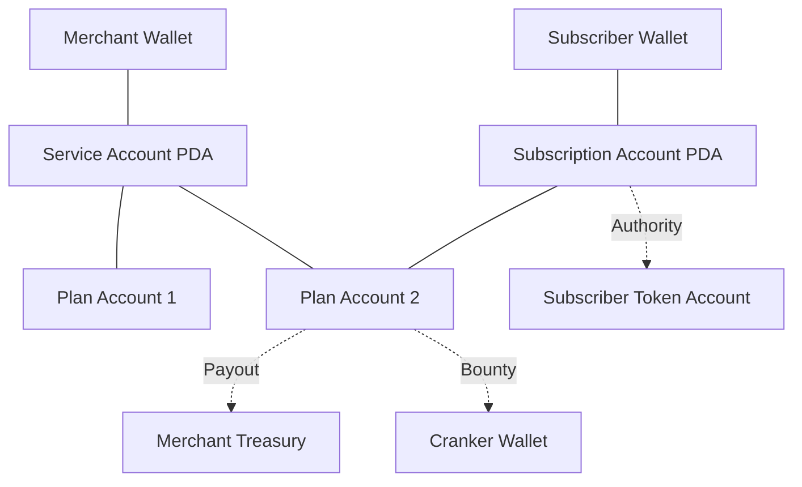
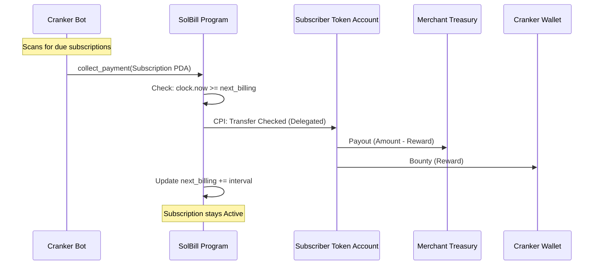

# SolBill: Autonomous Recurring Billing Engine

SolBill is a production-grade, non-custodial recurring billing protocol built on Solana. It allows merchants to create subscription plans and enables "Crankers" to earn bounties for processing payments, creating a fully autonomous billing ecosystem.

## 🚀 Top Features

- **Autonomous Billing**: Payments are collected automatically by a network of incentivized "Crankers" (bots).
- **Merchant-First Design**: Merchants define their treasury, accepted tokens (USDC/SOL/any SPL), and custom billing intervals.
- **Pay Upfront**: Supports immediate payment collection at the moment of subscription creation.
- **Permissionless Bounties**: Every plan includes a `crank_reward`. Anyone who triggers a due payment receives a portion of the payment as a bounty.
- **Non-Custodial**: Funds always move from Subscriber to Merchant Treasury via delegated authority. SolBill never "holds" user funds.
- **Cranker Bot Included**: Ready-to-use TypeScript worker for automating payment collections and earning rewards.

## 🛠 Tech Stack

| Layer          | Technology                            |
| -------------- | ------------------------------------- |
| **Program**    | Anchor (Rust)                         |
| **Frontend**   | Next.js 16, React 19, Tailwind CSS v4 |
| **Client**     | Codama-generated, `@solana/kit` (v5)  |
| **Automation** | Bun / Node.js (TypeScript)            |
| **Testing**    | LiteSVM (Fast on-chain simulation)    |

## 📖 How it Works

1. **Initialize Service**: A merchant initializes a `ServiceAccount` and provides their `Treasury` token account.
2. **Create Plan**: The merchant defines a `PlanAccount` (e.g., "$10 every 30 days, with a $0.50 reward for the cranker").
3. **Subscribe**: A user subscribes to the plan. They pay the first month **upfront** and delegate authority to the program to pull future payments.
4. **Collect**: When the billing interval passes, the subscription becomes "Due".
5. **Crank**: A bot (the "Cranker") detects the due account and calls `collect_payment`. The subscriber pays, the merchant gets their funds, and the bot gets the bounty.

## 🏗 Architecture Analysis: Web2 vs. Solana

To meet the requirements of a modern billing engine, we translated traditional concepts into Solana's account model.

### 1. Account Model

SolBill uses a hierarchical PDA (Program Derived Address) structure:



- **ServiceAccount** (`['service', merchant_key]`): The root account for a merchant. Stores the treasury address and global stats.
- **PlanAccount** (`['plan', service_key, plan_index]`): Represents a billing tier (e.g., "Pro Plan"). Stores the price, interval, and crank reward.
- **SubscriptionAccount** (`['subscription', subscriber_key, plan_key]`): Represents the relationship between a user and a plan.
  - **Data**: Stores `next_billing_timestamp`, `status`, and `payments_made`.
  - **Authority**: This account acts as a **Delegate**. The user approves this PDA to spend their tokens.

### 2. The Billing Lifecycle (Cranker Flow)



### 3. Comparative Analysis

| Feature            | Web2 (e.g., Stripe)                           | SolBill (Solana)                                              |
| :----------------- | :-------------------------------------------- | :------------------------------------------------------------ |
| **State**          | Rows in a centralized SQL database.           | `Account` structs stored on-chain (PDA).                      |
| **Trust**          | Users trust Stripe to charge correctly.       | Users trust the **Program Logic** (immutable or upgradeable). |
| **Authorization**  | API Keys & OAuth tokens.                      | SPL Token `approve` (Delegate Authority).                     |
| **Recurring Jobs** | Internal cron scheduler (e.g., Celery/Kafka). | **Incentivized Crank**: External bots triggered by bounties.  |
| **Fees**           | ~2.9% + $0.30 per transaction.                | Network Gas (~$0.00025) + optional Cranker Bounty.            |

### 3. Trade-offs & Constraints

- **Rent Costs**: Creating accounts on Solana costs SOL (Rent). SolBill is designed so the **Subscriber pays the rent** for their subscription account (approx. 0.002 SOL), which is refunded if they close the account.
- **Precision**: We use `u64` for token amounts. Time is tracked in `i64` unix timestamps.
- **UX Friction**: The user must sign two transactions initially: 1) `Approve` token usage, 2) `Create Subscription`. (In a production app, these can be bundled into a single Atomic Transaction).
- **Liveness**: If the `crank_reward` is too low, bots might ignore the transaction. The merchant must price the bounty competitively to ensure execution.

## 🚀 Deployment & Demo

**Program ID**: `AK2xA7SHMKPqvQEirLUNf4gRQjzpQZT3q6v3d62kLyzx` (Devnet)

### Live Transaction Links (Devnet)

> _Transaction links will be added after final deployment._

- **Initialize Service**: [TX_LINK]
- **Create Plan**: [TX_LINK]
- **Subscribe (Upfront)**: [TX_LINK]
- **Auto-Collection (Crank)**: [TX_LINK]
- **Cancel**: [TX_LINK]

## 📁 Project Structure

```text
├── app/
│   ├── components/solbill/    # Premium UI components
│   ├── generated/solbill/     # Codama-generated SDK
│   └── page.tsx               # Dashboard Preview
├── anchor/
│   ├── programs/solbill/      # Core Program Logic (Rust)
│   │   ├── instructions/      # Modular instruction handlers
│   │   └── state/             # Account definitions
│   └── tests/                 # Billing cycle simulations
├── scripts/
│   └── worker.ts              # The Cranker Bot (Production Ready)
└── codama.json                # SDK Generation Config
```

## ⚙️ Quick Start

### 1. Installation

```bash
npm install
```

### 2. Build & Test

```bash
npm run anchor-build
npm run anchor-test
```

### 3. Generate Client SDK

If you modify the program, regenerate the TypeScript SDK:

```bash
npm run setup   # Rebuilds program and runs Codama logic
```

### 4. Run the Cranker Bot

To start earning rewards as a bot operator:

```bash
# Make sure your merchant keypair is in anchor/target/deploy/
bun scripts/worker.ts
```

## 🧪 Testing Logic

Our test suite in `anchor/programs/solbill/src/tests.rs` covers:

- Service & Plan initialization.
- **Upfront Payment Verification**: Ensures funds move immediately upon subscription.
- **Bounty Calculations**: Validates that the Cranker receives the exact reward specified in the plan.
- **Billing Intervals**: Uses `LiteSVM` clock manipulation to simulate months of billing in milliseconds.

## 📜 License

MIT
