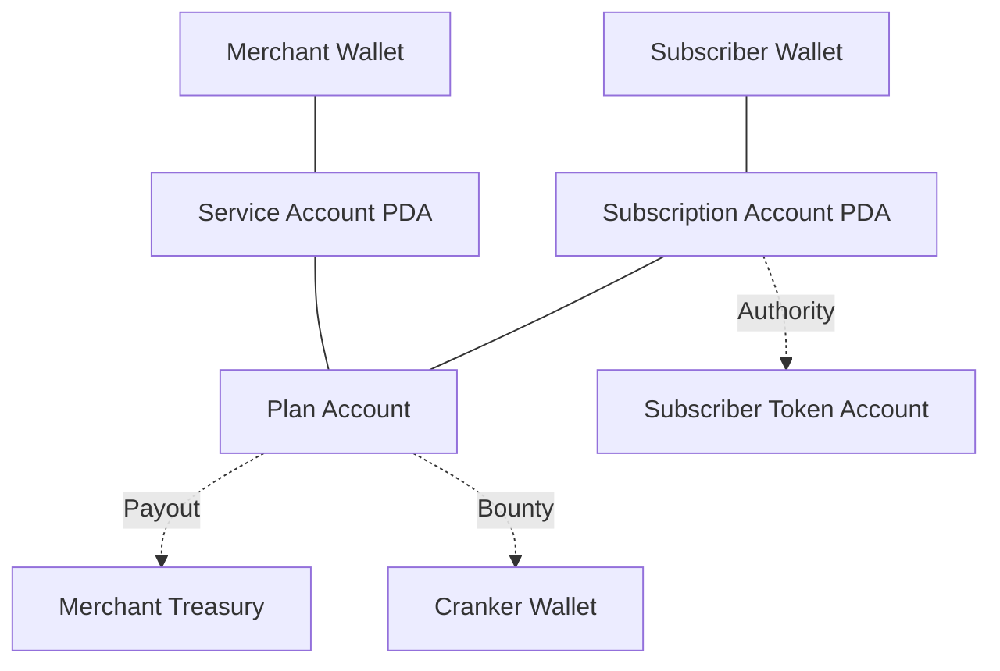

# SolBill: Autonomous Recurring Billing Engine

SolBill is a production-grade, non-custodial recurring billing protocol built on Solana. It reimagines traditional Web2 subscription systems (like Stripe) as a transparent, on-chain autonomous ecosystem.

---

## 🚀 Key Features

- **Autonomous Billing**: Payments are collected automatically by a network of incentivized "Crankers" (bots).
- **Flexible Billing Cycles**: Supports **Infinite** recurring subscriptions, **Fixed-Term** installments (e.g., 12 months), and **One-Time** lifetime purchases.
- **Pay Upfront**: Every subscription triggers an immediate first payment at the moment of creation.
- **Merchant-First Design**: Merchants define their treasury, accepted tokens (USDC/SOL/any SPL), and custom billing intervals.
- **Permissionless Bounties**: Every plan includes a `crank_reward`. Anyone who triggers a due payment receives a bounty.
- **Non-Custodial**: Funds move directly from Subscriber to Merchant via delegated authority. SolBill never "holds" user funds.
- **Stack-Optimized**: Engineered with low-stack footprints and zero-copy patterns for maximum reliability on Solana.

---

## 🏗 Architecture Analysis: Web2 vs. Solana

This project is a submission for the **Superteam "Rebuild a Backend System as a Solana Program"** bounty. We have reframed the "Subscription Billing + Task Queue" model into an on-chain architecture.

### 1. Comparative Analysis

| Feature        | Web2 (Stripe + SQS)                  | SolBill (Solana)                          |
| :------------- | :----------------------------------- | :---------------------------------------- |
| **State**      | Centralized SQL Database.            | On-Chain PDAs (Public & Auditable).       |
| **Trust**      | Users trust Stripe/Bank.             | Users trust **Open-Source Code**.         |
| **Control**    | Dark patterns in cancellation.       | **Instant Revocation** via Token Program. |
| **Automation** | Private Cron Jobs (Stripe Internal). | **Incentivized Cranks** (Permissionless). |
| **Fees**       | 2.9% + $0.30 per transaction.        | ~$0.00025 + optional bounty.              |

### 2. The Account Model (On-Chain Queue)

SolBill treats Solana as a **Distributed State Machine**. The "Queue" of what needs to be charged is stored entirely in Program Derived Addresses (PDAs):



- **ServiceAccount**: Root merchant configuration.
- **PlanAccount**: Template for billing (Price, Interval, Max Cycles).
- **SubscriptionAccount**: The live relationship. Stores `next_billing_timestamp` and `billing_cycle_count`.

---

## 📖 How it Works (The Lifecycle)

1. **Merchant Setup**: A merchant initializes a `ServiceAccount` and defines `PlanAccounts`.
2. **Subscribe**: A user selects a plan. They pay the first month **upfront** and call `approve` on the Token Program, delegating permission to the Subscription PDA to pull future payments.
3. **The Crank**:
   - The `collect_payment` instruction enforces timing rules: `require!(clock.now >= next_billing)`.
   - If the plan is **Fixed-Term** or **One-Time**, the program automatically blocks additional billing once `cycle_count >= max_cycles`.
   - If the payment succeeds, the Cranker receives the `crank_reward` bounty instantly.

---

## 📁 Project Structure

```text
├── anchor/
│   ├── programs/solbill/      # Core Program Logic (Rust)
│   │   ├── instructions/      # Modular handlers (Stack-optimized)
│   │   └── state/             # Account schemas (InitSpace included)
│   └── tests/                 # LiteSVM simulations (Billing cycles)
├── app/
│   ├── components/solbill/    # Premium Dashboard UI
│   └── generated/solbill/     # TypeScript SDK
└── scripts/
    └── worker.ts              # Cranker Bot (Bounty Hunter)
```

---

## ⚙️ Deployment & Demo

**Program ID**: `AK2xA7SHMKPqvQEirLUNf4gRQjzpQZT3q6v3d62kLyzx`

### Devnet Simulation

Our test suite uses `LiteSVM` to simulate years of billing in milliseconds, verifying:

- **Upfront Payments**: Ensured at subscription.
- **Finite Billing**: 1/1 (One-time) or X/X (Installment) enforcement.
- **Cranker Incentives**: Mathematical precision of bounty payouts.

---

## 📜 License

MIT
